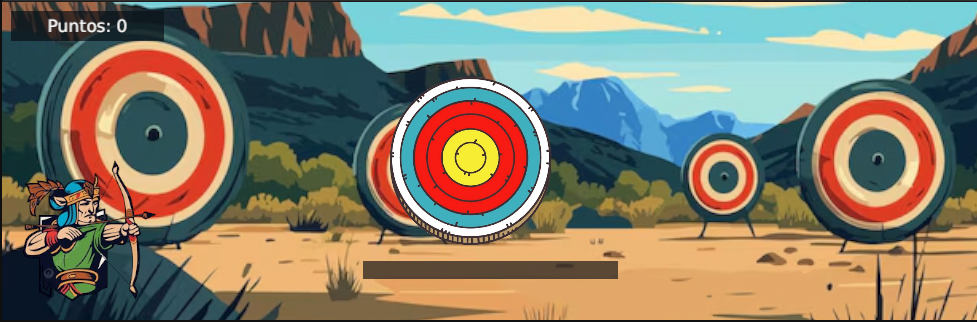
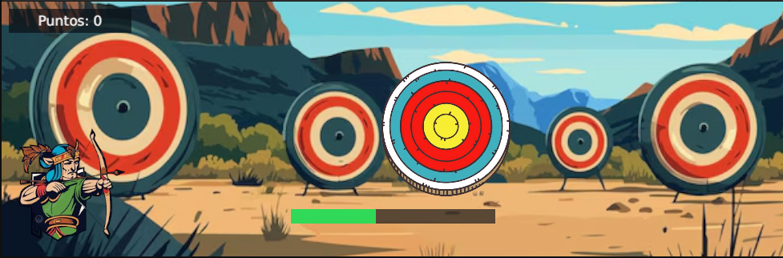
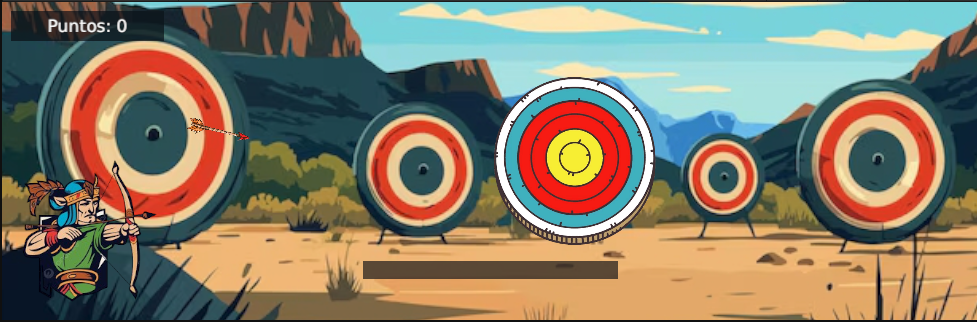
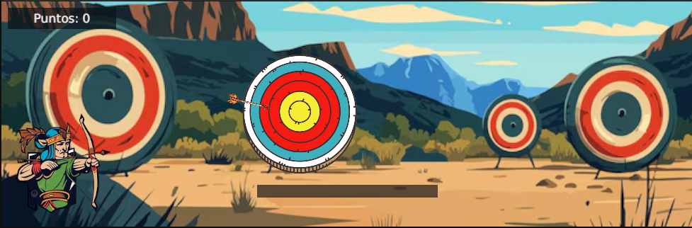

# Diana en movimiento

## Estudiante

- **Nombre:** Michael Santiago Martinez López
- **Parcial:** #2

## Descripción

Juego de tiro al blanco en 2D (Unity 6, URP): una diana se mueve horizontalmente de forma continua. Mantén **Espacio** para cargar potencia y suelta para lanzar la flecha con trayectoria parabólica (gravedad). Solo el **centro de la diana** (bullseye) suma **10 puntos** por acierto; los anillos exteriores muestran el mensaje «¡Fallaste!». La barra inferior indica la fuerza del disparo.

## Controles

| Acción        | Tecla   |
|---------------|---------|
| Cargar / disparar | Espacio (mantener y soltar) |

## Capturas de pantalla

Todas están en la carpeta **`Screenshots/`** (raíz del repositorio).

### 01 — Pantalla inicial / estado del juego

Al iniciar el modo **Play**, se ve el escenario (fondo, diana móvil, arquero a la izquierda), la UI con **Puntos: 0** y la barra de potencia vacía abajo.

### 02 — Carga de disparo (barra de potencia)

Con la tecla **Espacio** mantenida, la barra inferior se llena y muestra la fuerza acumulada antes de soltar el disparo.

### 03 — Flecha en vuelo

Tras soltar **Espacio**, la flecha sigue una trayectoria parabólica (con gravedad) hacia la diana.

### 04 — Flecha cerca de la diana

Momento de gameplay en el que la flecha se aproxima a los anillos de la diana; el acierto depende de que la **punta** entre en el collider del centro (bullseye).

### 05 — Puntuación y feedback

Tras un acierto en el centro, el texto **Puntos** aumenta de 10 en 10 y puede mostrarse el mensaje **«¡Genial!»** (acierto); en un fallo en anillos exteriores aparecería **«¡Fallaste!»**.

## Cómo ejecutar el proyecto

1. Clonar el repositorio (sin la carpeta `Library/`).
2. Abrir el proyecto con **Unity 6** (6000.x), o compatible.
3. Abrir la escena `Assets/Scenes/SampleScene.unity`.
4. Pulsar **Play**.

**Nota:** El contenido de juego (diana, fondo, UI, arco) se genera en tiempo de ejecución mediante el objeto **GameBootstrap** en la escena. El prefab de la flecha está en `Assets/Prefabs/Arrow.prefab` y se carga también desde `Assets/Resources/Arrow.prefab` para el disparo.

El fondo usa la imagen `Assets/Sprites/background.jpg` importada como **Sprite** y referenciada en **GameBootstrap** (se escala para cubrir la cámara). Si cambias el archivo, deja el tipo de textura en **Sprite (2D and UI)** y pulsa **Apply**.